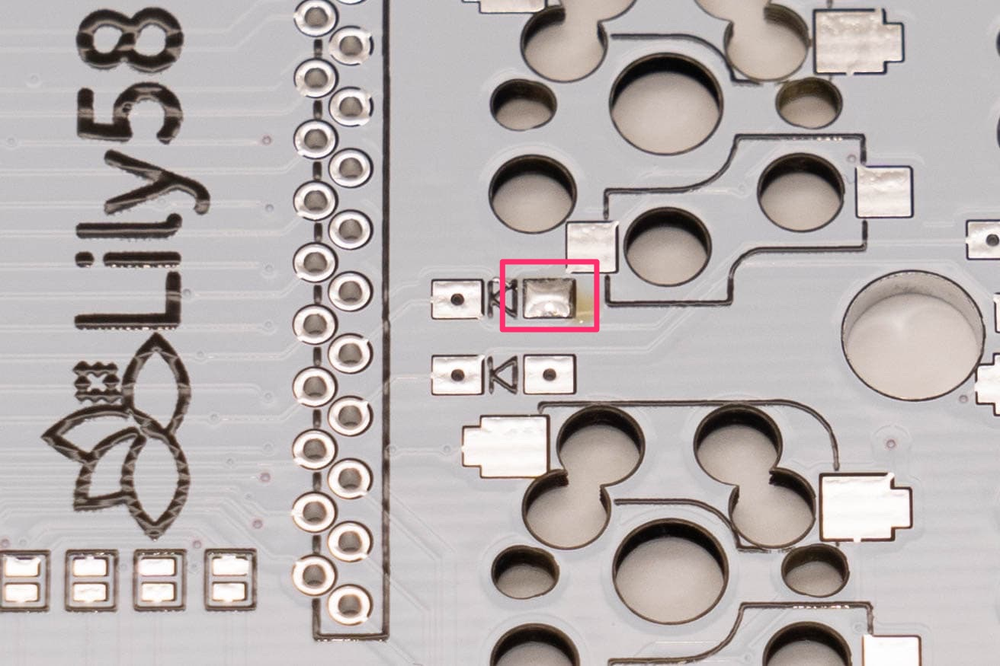
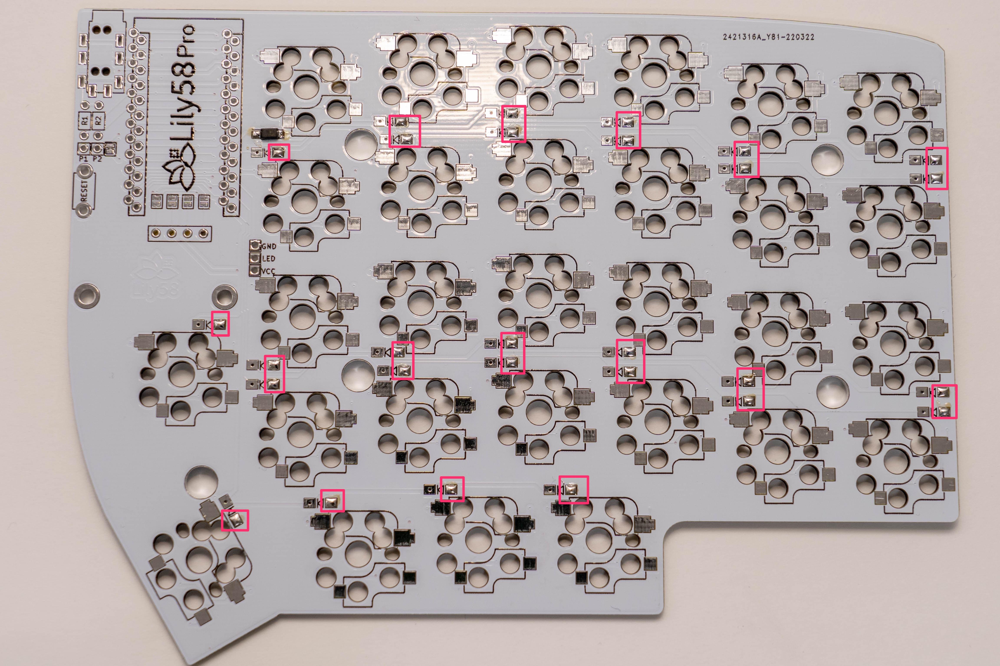

# Lily58 Pro 組み立て方

この基板(PCB)はリバーシブルタイプです**片面づつに**部品を実装していきます。
## マスキングテープを取り付ける
裏表をわかりやすくするためマスキングテープなどを表面に貼り付けます。

## ダイオードはんだ付けする
!!! attention
    ダイオードの取り付けは**テープを貼り付けてない基板裏側**に行います。
!!! info
    リールの中に入ったチップダイオードを使用しています。    
    取り出す際に飛んでいかないようにゆっくりと開封してください。

ダイオードを取り付ける場所に予備はんだをします。  
パッドの片方にはんだごてを当て、はんだを少し溶かします。

ダイオードに刻印されている線と基板のダイオードのマークの線の向きを合わせてはんだ付けを行います。
向きが正しくないとキーが反応しません。

ピンセットを使用してダイオードをはんだ付けします。  
ダイオードの片側を予備はんだを使用して固定してから反対側もはんだ付けします。

残りのダイオードも同じ要領ではんだ付けします。  
1.予備はんだを行う

2.予備はんだを使ってダイオードを仮固定する。

3.ダイオードをはんだ付けする。

## OLED用のジャンパを行う
OLEDを使用するために

## Pro Microを取り付ける  
!!! attention
    ProMicroの袋に同封されているピンヘッダの使用はProMicroが破損した際に交換ができないため推奨しません。    
    このビルドガイドではコンスルーの使用を前提とした記載をしています。

コンスルーを**PCBの線で囲まれている列を確認して**PCB表面に差し込みます。    
左右で差し込む場所が異なるため注意してください。 

ProMicroを乗せ、押し込みます。

ProMicroをはんだ付けします。
!!! attention
    ProMicroを取り外し可能にするため、はんだ付けする際は表面のみはんだ付けしてください。    
    裏面にははんだ付けを行わないでください。

## TRRSジャック リセットボタンをはんだ付けする
TRRSジャックを基板に差し込み、マスキングテープなどで仮固定して裏側からはんだ付けします。

リセットボタンを基板に差し込み、裏側からはんだ付けします。

## 組み立て進行度
- [x] ダイオードを取り付ける
- [x] TRRSジャック、リセットボタンを取り付ける
- [x] ProMicroを取り付ける
    - [ ] 動作確認を行う
- [ ] スイッチソケットを取り付ける
- [ ] OLEDを取り付ける
- [ ] スイッチの取り付け
    - [ ] 動作確認を行う
- [ ] ファームウェアを書き込む

## 次へ : [ProMicroの動作確認〜OLEDを取り付ける](Lily58_Pro_BG_2.md)