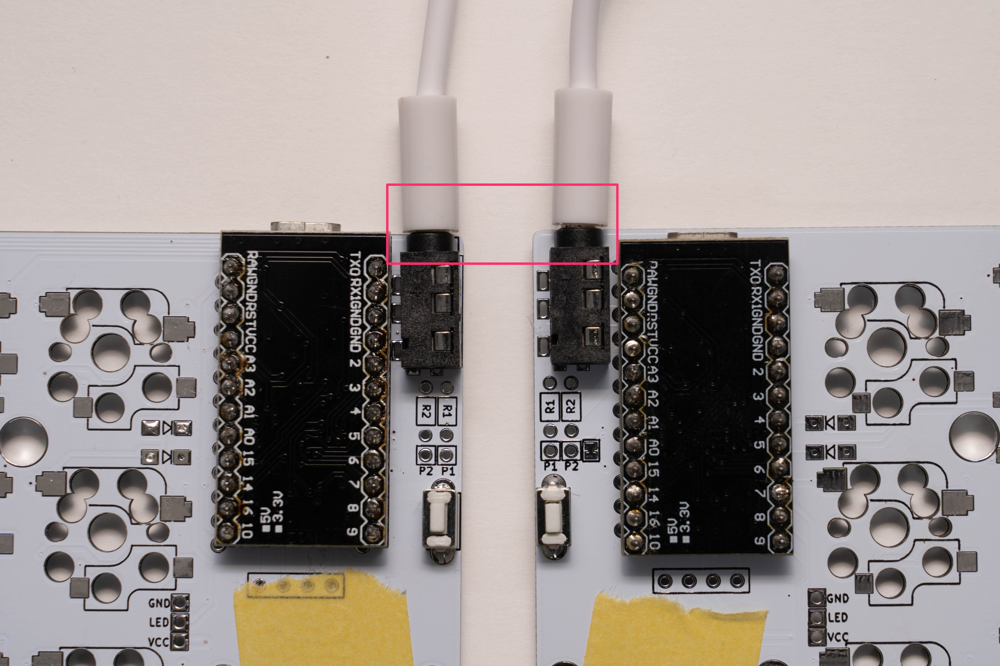
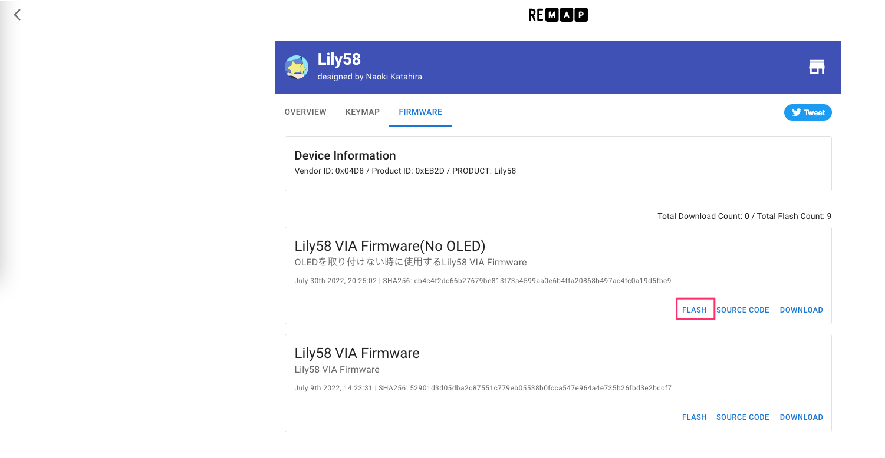
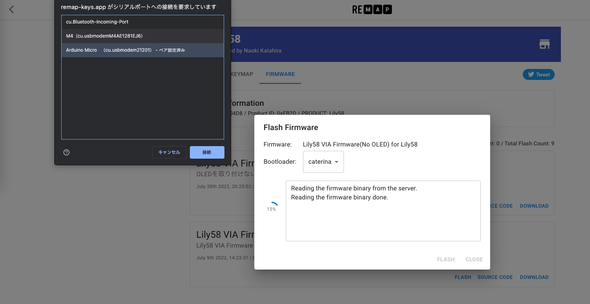
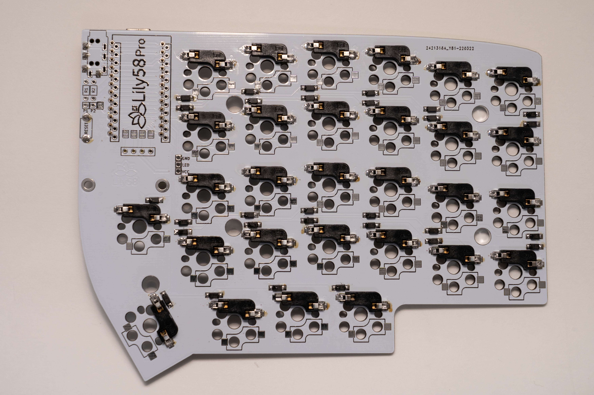

# Lily58 Pro 組み立て方
## ProMicroの動作確認を行う
Remapのサイト上でファームウェアの書き込みと動作確認を行います。     
TRRSケーブルを奥まで差し込み、左側のProMicroにUSBケーブルを差し込みます。

!!! info
    Chrome 89以上を使用してアクセスを行ってください
- [ファームウェア書き込みページ](https://remap-keys.app/catalog/jztXFjMO9ZAIzyFT7CSe/firmware)

`Lily58 VIA Firmware(No OLED)`の`FLASH`を選択しChromeのダイアログが出てきたらLily58のリセットボタンを押します。   
Lily58を選択して接続後、問題がなければ書き込みが行われます。

USBケーブルを反対側に差し替え、`FLASH`をクリックし、**右側のProMicroにも**ファームウェアの書き込みを行います。
右側のProMicroへの書き込み終了後、USBケーブルを左側のProMicroに刺し戻します。

[動作確認ページ](https://remap-keys.app/configure)へアクセスします。    
`+ KEYBOARD`をクリックしChromeのダイアログ上のLily58を選択肢し、接続します。    
  
右下メニューの`Test Matrix mode`を選択し、動作確認を行います。  
  
動作確認はピンセットなど導通するものを使用し、写真のようにショートさせることで動作確認を行います。 
Test Matrixの画面を見ながらすべて動作するか確認します。 

ダイオードの取り付けや基板、ProMicroに問題がない場合すべて青く変わります。
  

## ソケットをはんだ付けする
ソケットはダイオードと同じ裏面に取り付けをします。

ダイオードと同じようにソケットのパッドの片方に予備はんだをし、ソケットを載せ、ピンセットや手で抑えながらはんだ付けをします。(手で抑える場合は火傷にご注意ください。)  
MXソケットの場合は上側に、Chocソケット(ロープロファイル版)の場合は下側に取り付けます。  

同じように予備はんだを行い、片方を仮はんだ、両側をしっかりとはんだ付けします。
力がかかる部品のため、はんだ忘れやソケットの浮きがないか確認をします。  

## OLEDを取り付ける
表面につけていたマスキングテープを剥がし、OLEDソケットを差し込みます。
OLEDソケットを裏側からはんだ付けするためにマスキングテープで固定します。この際に真っ直ぐに固定されているか確認します。

裏側からはんだ付けします。
!!! attention
    はんだを流しすぎるとソケット内部まで流れ込んでしまいますので注意して作業を行ってください。

OLEDソケットを固定していたマスキングテープを剥がし、OLED用ピンを差し込みます。

その上にOLEDモジュールを乗せ、4箇所をはんだ付けします。
はんだ付け後、OLEDモジュールのフィルムを剥がします。

## 組み立て進行度
- [x] ダイオードを取り付ける
- [x] TRRSジャック、リセットボタンを取り付ける
- [x] ProMicroを取り付ける
    - [x] 動作確認を行う
- [x] スイッチソケットを取り付ける
- [x] OLEDを取り付ける
- [ ] スイッチの取り付け
    - [ ] 動作確認を行う
- [ ] ファームウェアを書き込む

## 次へ : [スイッチの取り付け〜完成](Lily58_Pro_BG_3.md)