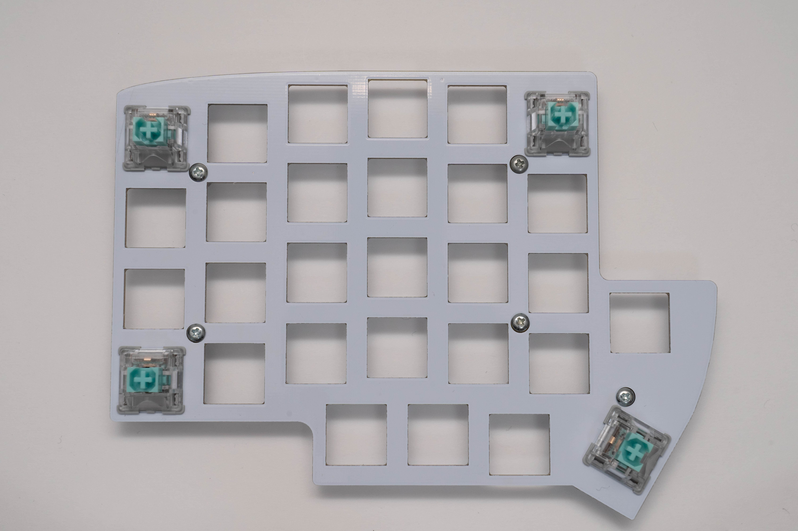
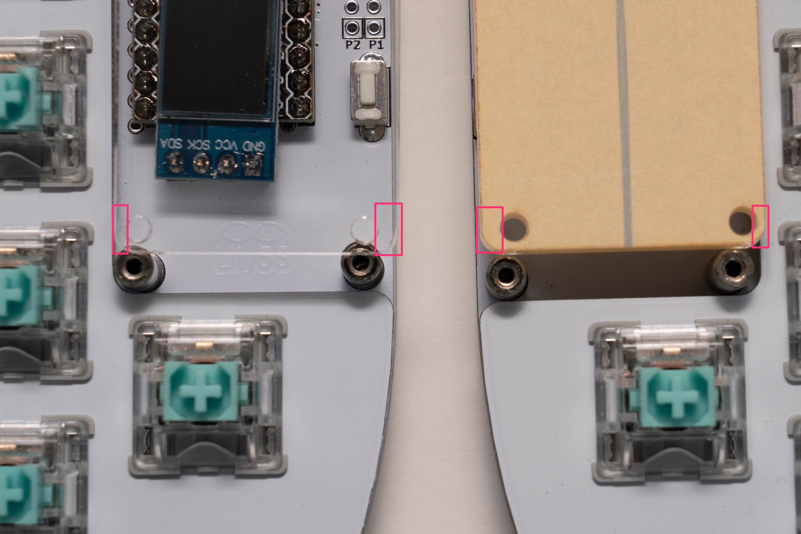
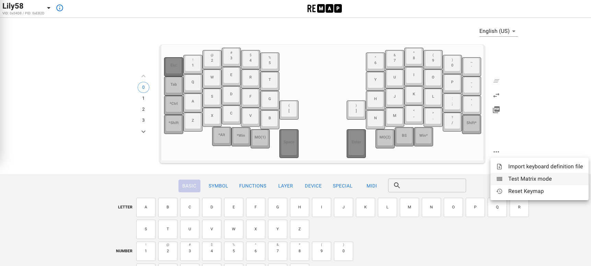
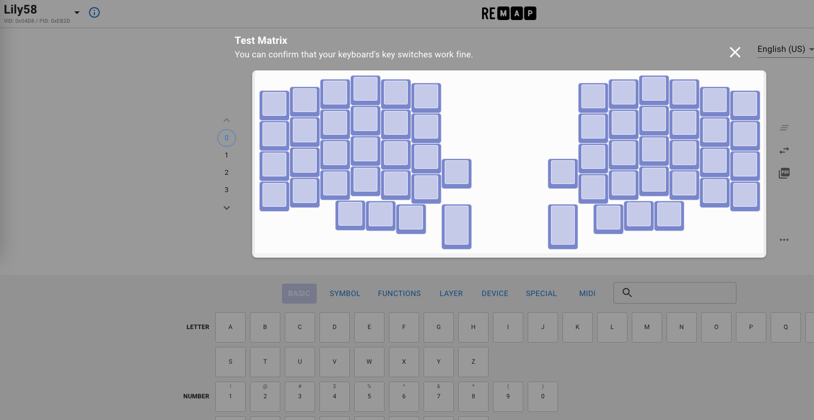

# Lily58 Pro 組み立て方
## スイッチの取り付け
トッププレート、ねじ、六角7mmスペーサー(短)を用意します。

トッププレートにネジとスペーサーを仮止めします。

トッププレート四隅にキースイッチをしっかりと差し込み、Lily58 Pro基板に重ねて差し込みます。

!!! attention
    スイッチのピンが曲がらないように気をつけながら差し込みを行ってください。

残りのスイッチを差し込みます。

## ProMicro保護プレートの取り付け
ねじ、10mm丸スペーサー(長)を用意し、ドライバー等を使ってしっかりと取り付けます。

ProMicro保護プレートを用意し、向きを確認します
幅が広いほうが外側、幅が広いほうが内側(スイッチ側)となります。

保護プレートのフィルムを剥がし、ネジ止めします。

## バックプレートの取り付け
バックプレートとネジを用意し、バックプレートとゴム足を取り付けます。

トッププレート取り付け後、トッププレートのネジを締め直します。

## ファームウェアを書き込む
ProMicroの動作確認時に使用したRemapを使用して再度ファームウェアを書き込みを行います。
- [ファームウェア書き込みページ](https://remap-keys.app/catalog/jztXFjMO9ZAIzyFT7CSe/firmware)  
`Lily58 VIA Firmware`の`FLASH`を選択しChromeのダイアログが出てきたらLily58のリセットボタンを押し、ファームウェアを書き込みます。

[動作確認ページ](https://remap-keys.app/configure)へアクセスし、動作確認をします。

このページでキーマップの変更も行えます。お好みのキーマップに変更してみましょう。

## 組み立て進行度
- [x] ダイオードを取り付ける
- [x] TRRSジャック、リセットボタンを取り付ける
- [x] ProMicroを取り付ける
    - [x] 動作確認を行う
- [x] スイッチソケットを取り付ける
- [x] OLEDを取り付ける
- [x] スイッチの取り付け
    - [x] 動作確認を行う
- [x] ファームウェアを書き込む

## 完成
キーキャップを取り付けて完成です。組み立てお疲れさまでした。
