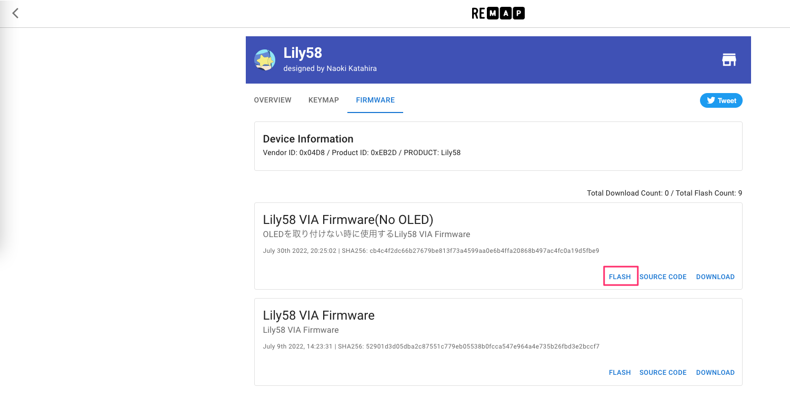
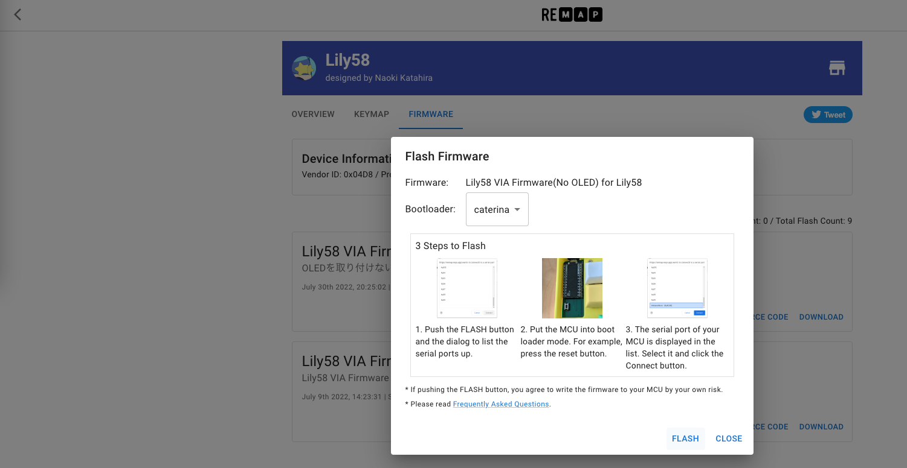
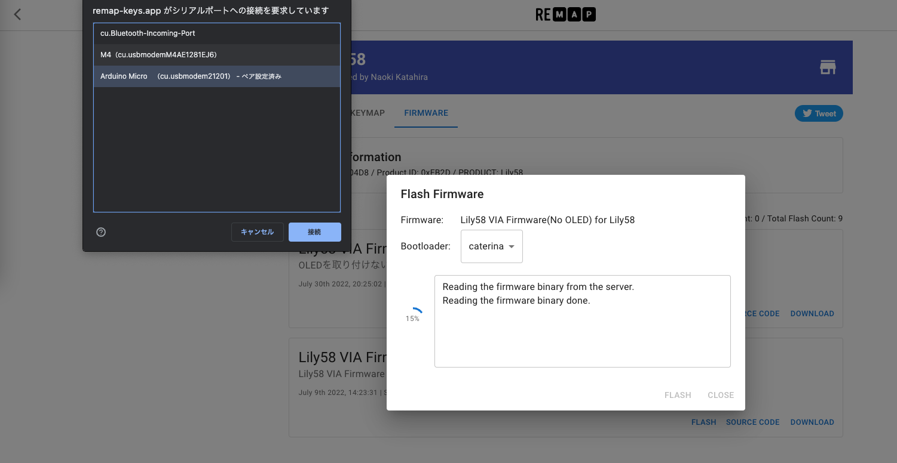
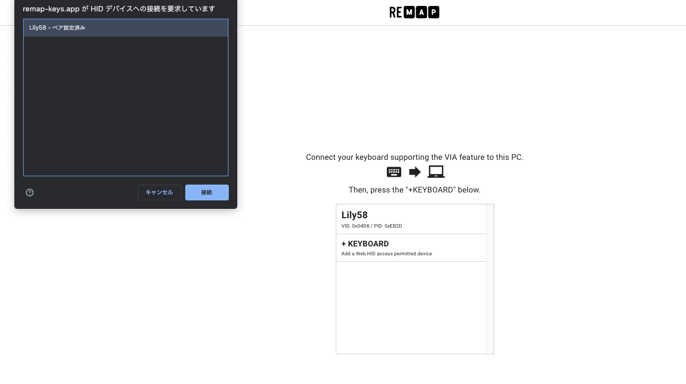
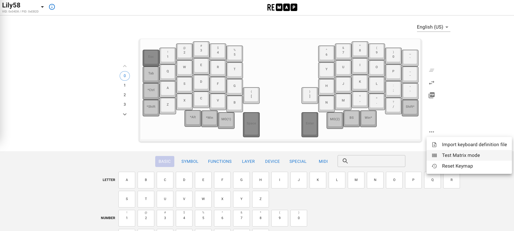
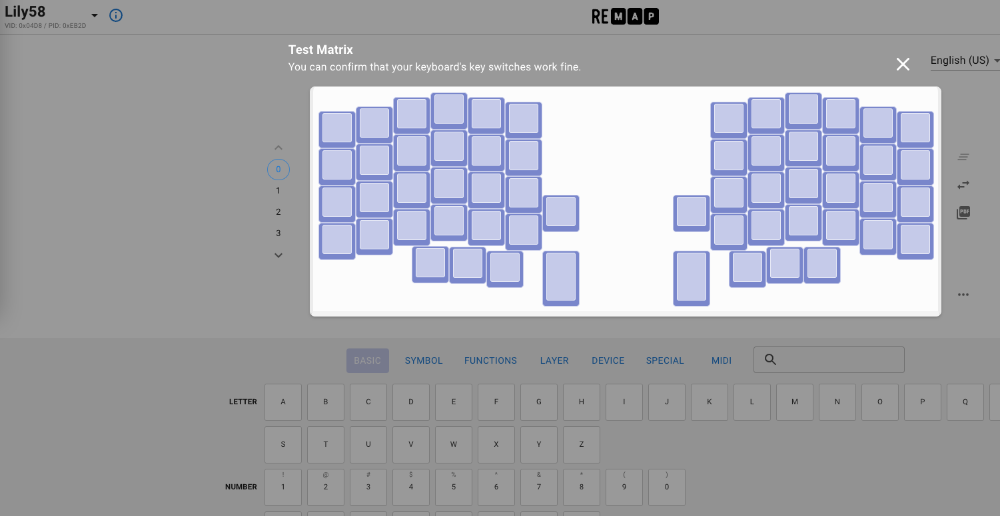

# キーマップの書き込み/編集

## Remapを使用してキーマップを書き込み・編集する(推奨)
## ファームウェアを書き込む
!!! 必要なもの  
    ・TRRSケーブル  
    ・MicroUSBケーブル  
    ・動作確認をするパソコン
[Remap](https://remap-keys.app/)のサイト上でファームウェアの書き込みと動作確認を行います。
!!! info
    Google Chrome 89以上を使用してアクセスを行ってください
- [ファームウェア書き込みページ](https://remap-keys.app/catalog/jztXFjMO9ZAIzyFT7CSe/firmware)

ProMicroを接続し、`Lily58 VIA Firmware(No OLED)`の`FLASH`を選択しChromeのダイアログが出てきたらLily58のリセットボタンを押します。   
Lily58を選択して接続後、問題がなければ書き込みが行われます。

USBケーブルを反対側に差し替え、`FLASH`をクリックし、**右側のProMicroにも**ファームウェアの書き込みを行います。
右側のProMicroへの書き込み終了後、USBケーブルを左側のProMicroに刺し戻します。

[動作確認ページ](https://remap-keys.app/configure)へアクセスします。    
`+ KEYBOARD`をクリックしChromeのダイアログ上のLily58を選択肢し、接続します。    
  
右下メニューの`Test Matrix mode`を選択し、動作確認を行います。  
  
キースイッチを押し、Test Matrixの画面を見ながらすべて動作するか確認します。 
組み立てに問題がない場合すべて青く変わります。
  

このページでキーマップの変更も行えます。お好みのキーマップに変更してみましょう。

## QMK Toolboxを使用したキーマップの書き込み
!!! info
    QMK Toolboxを使用したキーマップの書き込みはRemapが使用できない場合に行ってください。
以下のソフトウェアとファイルを使用して書き込みとキーマップの変更をします。

- [QMK Toolbox](https://github.com/qmk/qmk_toolbox/releases)  
- [VIA Configurator](https://github.com/the-via/releases/releases/)
- [lily58_rev1_via.hex](https://drive.google.com/file/d/1pNQqg-wFip-hwCnLi7aFFjNfxRyyM5Q5/view?usp=sharing)  
- [lily58_rev1_via_noOLED.hex](https://drive.google.com/file/d/19CiNewbTT1lCRrP8-DUQJo7VaEKvU591/view?usp=sharing)
    - (OLEDを取り付けない場合はこちらのファームウェアを利用してください)  

QMK Toolboxを立ち上げ、Local fileに`lily58_rev1_via.hex`を指定します。    
Lily58をUSBケーブルで接続し、リセットボタンを押した後Flashボタンを押して書き込みを行います。  
右上の”Auto-Flash”にチェックを入れているとリセットボタンを押しただけで自動的に書き込みを開始できます。  
  
`avrdude.exe done.  Thank you.`
と表示されれば完了です。  
これを左右両方行ってください。

## 動作確認
TRRSケーブルを左右に接続した後にUSBケーブルを接続します。  
USBケーブルを接続中に抜き差しを行うとTRRSの構造上ショートする可能性があります、ご注意ください。  
  
キーテスターサイトやツールなどですべてのキーが動作するかチェックします。  
レイヤーキーは押しながらレイヤーが変わることを確認してください。  
後述するVIAにもキーテスターが内蔵されています。  

## VIAを使用してキーマップを編集する
ファームウェアを書き込み後VIA Configuratorを使用してキーマップの書き換えを行います。

VIAを起動後キーボードを接続すると編集画面が表示されます。  
  

VIAを使用したキーマップ編集の詳しい解説は以下のブログなどを参考にしてください。  
[（初心者編）VIAを使ってキーマップを書き換えよう - 自作キーボード温泉街の歩き方](https://salicylic-acid3.hatenablog.com/entry/via-manual)

複雑な動作をキーマップに組み込む場合ご自身でqmkのビルド環境を構築して編集しビルドして頂く必要がございます。  

## 正しく動かない時
 - [動かない時](help.md)

## カスタマイズ情報
 - [カスタマイズ情報](customize.md)